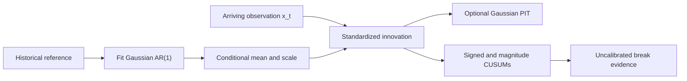

# BreakForge

**A Research Framework for Causal Structural Break Detection**

[](https://github.com/TranTrinhNhan1/BreakForge/actions/workflows/ci.yml)
[](LICENSE)

BreakForge is a research framework for causal, real-time structural-break detection in heterogeneous univariate time series. The ADIA Lab / CrunchDAO challenge supplied the original problem; the repository presents reusable methods, a reference detector, and the lessons learned from validation and failed experiments.

## Why BreakForge?

Online scores must reflect only information available when each observation arrives. BreakForge makes this constraint explicit and pairs a small streaming API with a broad, evidence-labeled research record.

## Problem definition

Given a reference history and stream `x_0, x_1, ...`, produce break evidence at each time `t`. The score may depend on the fitted reference and observations through `x_t`, never on future values or final stream length.

## Causal contract

`fit(history)` estimates and freezes the reference model. Each `update(x_t)` consumes one new observation and returns evidence through that time. `reset()` clears online state and restarts from the fitted history endpoint.

## Architecture



The public reference uses conditional Gaussian innovations and sequential CUSUM evidence. Its score is not a calibrated probability or alarm guarantee. PIT interpretation depends on the adequacy of the fitted conditional model.

## Quick start

Create an isolated environment, then install and run the synthetic demo:

```bash
python -m venv .venv
# macOS / Linux
.venv/bin/python -m pip install -e .
.venv/bin/python examples/synthetic_break_demo.py
```

On Windows PowerShell, use `.venv\Scripts\python.exe` in place of `.venv/bin/python`. For an optional plot, install `.[plot]` into the same environment and add `--plot` to the demo command. The demo generates an AR series with a coefficient and noise-scale break; it needs no competition data or credentials.

## Streaming API

```python
from breakforge import StructuralBreakDetector

detector = StructuralBreakDetector(allowance=0.25).fit(history)
for x_t in stream:
    score = detector.update(x_t)
detector.reset()
```

Inputs must be finite real values; `fit` requires at least three history observations. `update` returns a non-decreasing, uncalibrated score. Reset between independent series.

## Methods investigated

The catalog groups 140 evidence records into 135 method or variant records and five procedure or audit records. Staged reports are grouped when they describe the same recipe; run IDs, seeds, and folds are not counted as separate methods.

| Family | Examples | Role | Outcome in this project |
|---|---|---|---|
| Conditional normalization and score transforms | AR residuals, ECDF/PIT, Gaussian scores, copula variants | Normalize each series against its reference history | The public core uses a small Gaussian AR(1) PIT model; its interpretation depends on conditional-model adequacy. |
| Statistical and sequential baselines | Rolling moments, quantiles, autocorrelation, CUSUM | Provide simple change evidence and controls | CUSUM remains in the reference detector; extra rolling summaries did not establish stable gains. |
| Conformal and sequential inference | Betting processes, restart mixtures, conformal martingales | Accumulate evidence and express uncertainty over change time | More complex branches did not establish calibrated error control for dependent streams. |
| Kernel, discrepancy, and density comparison | RFF/MMD, density ratios, Wasserstein comparisons | Detect distributional changes beyond a fixed parametric score | Tested configurations were mixed and were not promoted as the public reference. |
| Dynamical and Bayesian models | AR likelihoods, context trees, DMD/Koopman, run-length models | Detect changes in transitions or latent dynamics | Selected results did not consistently transfer to reduced diagnostics; conclusions are configuration-specific. |
| Spectral and multiscale evidence | Fourier, wavelet, bispectral features | Detect changes in periodicity and scale structure | No tested configuration earned promotion; performance depended on the break mechanism. |
| Path, geometry, and ordinal structure | Signatures, recurrence geometry, ordinal patterns | Represent order and path interactions | Signature controls were small or changed sign across folds; other variants remain configuration-specific. |
| Learned representations and neural methods | Contrastive encoders, TNC, CNN/TCN pilots, foundation models | Learn features intended to transfer across streams | Pilots did not establish a clean, independent transfer benchmark. |
| Supervised heads, ensembles, and selection | Tree heads, rankers, stacked blends, automated search | Combine or rank detector evidence | Historical scores include partial-fold and post-selection screens; they do not establish a clean family-wide benchmark. |
| Other causal evidence methods | Hazard, residual, and online-comparison features | Capture additional prefix-based change evidence | The catalog preserves method-specific controls and limitations without claiming a family-wide result. |

Only the compact reference detector is in the public core. The [method catalog](docs/method_catalog.md) records questions, controls, validation scope, and limitations; [failed experiments](docs/failed_experiments.md) curates negative and inconclusive results. The separate 111-record score inventory is grouped by its 30 source model-family labels; those are run counts, not additional method counts.

## Results

### Public synthetic benchmark

Across six generated break mechanisms, the reference detector's AUC ranges from 0.4781 to 1.0000. The heavy-tail case is near chance (0.4781 AUC; 0.075 detection rate). These fixed-seed results describe selected synthetic generators, not general performance. Full metrics and settings are in [results](docs/results.md).

### Official competition result

The strongest verified private result recorded here is TS-AUC **0.6213427008** for submission #21 / run 120227. Final rank is not independently verified, package identity is incomplete, and the submitted system differs from the public reference. It is not a benchmark for BreakForge.

Historical competition CV results remain separate and labeled, including future-length leakage, nested-OOF contamination, post-selection, and partial-fold cases. The [results record](docs/results.md) separates its 57 curated comparisons from a broader 111-record source inventory; neither replaces the synthetic benchmark or supports claims about clean competition performance.

## Validation lessons

- A real-time score cannot use `final_online_length` or other future-derived values.
- Every upstream fit in stacked evaluation must exclude the outer held-out group.
- Repeatedly selected folds do not provide an untouched estimate.

See the [validation guide](docs/validation.md) for exact-stream protocols and causal tests.

## What did not work

Some high historical scores depended on future information or contaminated stacked features. Several selected methods lost their apparent advantage against matched controls or on reduced diagnostics. These findings apply to tested configurations, not whole method families.

## Competition origin and data

The Structural Break: Real-Time challenge motivated this work and its streaming constraints. Competition data, labels, predictions, and submission bundles are not included; users must provide data they are authorized to use. See [competition background](docs/competition.md).

## Repository structure

```text
src/breakforge/       causal detector, conditional PIT, validation utilities
examples/             synthetic streaming demonstrations
tests/                causality, reset, parity, determinism, fold isolation
configs/              reference configuration
scripts/              reproduction and user-data evaluation
reports/              synthetic results and curated research records
docs/                 methodology, validation, results, and research history
research_archive/     indexed conclusions from selected research
```

## Reproducibility and documentation

With the virtual environment from the quick start:

```bash
.venv/bin/python -m pip install -e '.[dev]'
.venv/bin/python -m pytest -q
.venv/bin/python scripts/synthetic_benchmark.py
```

On Windows PowerShell, replace `.venv/bin/python` with `.venv\Scripts\python.exe`.

Start with [methodology](docs/methodology.md), [research journey](docs/research_journey.md), [references](docs/references.md), and [research workflow](docs/research_workflow.md).

## Citation

Use the project metadata in [CITATION.cff](CITATION.cff).

## License

BreakForge is distributed under the [MIT License](LICENSE).
