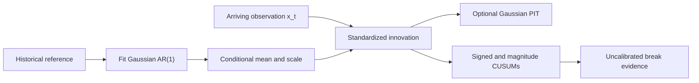

# BreakForge

**A Research Framework for Causal Structural Break Detection**

[](https://github.com/TranTrinhNhan1/BreakForge/actions/workflows/ci.yml)
[](LICENSE)

BreakForge studies causal, real-time break detection in heterogeneous univariate time series. The research grew out of the ADIA Lab / CrunchDAO Structural Break: Real-Time challenge and is presented here as a reusable research framework, with a small public reference detector and an honest record of methods, controls, and validation failures.

## Problem and approach

At time `t`, a detector may use its fitted reference and observations through `x_t`. It must not depend on future observations or the final stream length. BreakForge illustrates conditional normalization with a fixed Gaussian AR(1), then accumulates sequential evidence from each standardized innovation.

## Architecture



The public score is evidence, not a calibrated probability or alarm guarantee. The PIT is available separately; its interpretation depends on the conditional model being adequate.

## Quick start

```bash
pip install -e .
python examples/synthetic_break_demo.py
```

The demo generates its own AR process with a change in coefficient and noise scale. It needs no Crunch runtime or competition data. Add `--plot` after installing `pip install -e '.[plot]'` to save a figure.

## Streaming API

```python
from breakforge import StructuralBreakDetector

detector = StructuralBreakDetector(allowance=0.25)
detector.fit(history)  # estimate and freeze the reference

for x_t in stream:
    score = detector.update(x_t)  # consume one observation

detector.reset()  # clear online state while keeping the fitted reference
```

Inputs must be finite real values; `fit` requires at least three reference observations. `update` returns a non-decreasing, uncalibrated score. Resetting between series prevents state from leaking across IDs. See [methodology](docs/methodology.md) for assumptions and [validation](docs/validation.md) for the causal contract.

## Validation and results

| Evidence | Result | Interpretation |
|---|---:|---|
| Public synthetic benchmark | AUC 0.8288–1.0000 on five tested break mechanisms | Fixed-seed, 40 streams per mechanism; synthetic only |
| Heavy-tail synthetic shift | AUC 0.4781; detection rate 0.075 | A tested failure case for this reference detector |
| Official private run #21 / 120227 | TS-AUC 0.6213427008 | Different system from the public API; final rank unverified |

The synthetic benchmark is reproducible with `python scripts/synthetic_benchmark.py`; configuration, code revision, metric definition, and limits are in [results](docs/results.md). Historical competition CV values are not clean benchmarks: some used final-length information, some had nested-OOF contamination, and many were selected on the same folds. The high historical values remain visible with labels in [results](docs/results.md) and [validation](docs/validation.md).

## Methods investigated

| Family | Examples investigated | What the available evidence says |
|---|---|---|
| Statistical and sequential baselines | Rolling moments, CUSUM, multiscale evidence | Simple controls remain useful; the public reference combines conditional innovations with CUSUM evidence. |
| Conditional normalization and score transforms | AR residuals, empirical PIT, Gaussian scores, GARCH-style transforms | Useful for comparing a stream with its own history; misspecification can leave dependence or non-uniform scores. |
| Conformal and sequential inference | Betting processes, restart mixtures, predictive ranks, conformal martingales | No complex variant earned a calibrated public default; dependence assumptions and false-alarm control remain open. |
| Kernel, discrepancy, and density comparison | RFF/MMD, two-sample statistics, density ratios, Wasserstein comparisons | Some selected CV gains were small or failed matched/reduced checks; they are not clean performance estimates. |
| Dynamical and Bayesian models | AR coefficient drift, context trees, DMD/Koopman, run-length models | Tested configurations were not promoted; selected CV results often weakened on reduced diagnostics. |
| Spectral and multiscale evidence | Frequency, bispectral, wavelet, and block summaries | Responses depended on the change mechanism; the tested configurations did not establish robust transfer. |
| Path, geometry, and ordinal structure | Signatures, recurrence and visibility graphs, ordinal patterns | Feasibility or partial-fold signals did not justify promotion; matched low-order controls remain important. |
| Learned representations and neural methods | TNC, contrastive encoders, score models, CNN and GRU pilots | Results were limited by transfer, exact-stream parity, or fold nesting; no learned representation is in the public core. |
| Supervised heads, ensembles, and selection | Tree and ranking heads, stacked blends, automated search | Repeated CV selection and upstream OOF contamination can inflate apparent gains; see the validation audit. |
| Other causal evidence methods | Tail, dependence, and event-timing features | Mixed feasibility results; individual configurations remain exploratory rather than family-wide conclusions. |

These are summaries of tested configurations, not verdicts on whole research families. The catalog distinguishes detector ideas from representations, scoring heads, and selection procedures. See the [method catalog](docs/method_catalog.md), [failed and inconclusive experiments](docs/failed_experiments.md), and the [131-report index](reports/experiment_index.csv).

## What did not work

Some high historical CV scores depended on the final stream length or on upstream OOF predictions that had seen nominally held-out folds. A selected DMD/Koopman blend scored higher on those CV folds than the Trial 11 reference but lower on its reduced diagnostic. These are configuration-level observations, not clean benchmarks or family-wide conclusions; see the [labeled results](docs/results.md) and [validation postmortem](docs/validation.md).

## Competition context and data

The challenge supplied the research problem and real-time constraints. CrunchDAO announced the Real-Time edition closed on 2026-10-02; see its [closure notice](https://forum.crunchdao.com/t/2026-w40-closing-of-structural-break-real-time/1222) and [streaming leakage clarification](https://forum.crunchdao.com/t/leaderboard-comparability-after-the-june-8-real-time-data-access-fix-were-pre-fix-scores-rescored/1188). Competition data, labels, per-series predictions, and submission bundles are not included. Users must supply data they are authorized to use. The public examples and tests work without them.

## Repository map

```text
src/breakforge/       Causal detector, conditional PIT, validation utilities
examples/             Synthetic streaming demonstrations
tests/                Causality, reset, parity, determinism, fold isolation
configs/              Small reference configuration
scripts/              Reproduction and user-data evaluation
reports/              Synthetic results and curated historical aggregates
docs/                 Methods, validation, results, research history, references
research_archive/     Indexed conclusions from selected research
```

## Reproducibility

```bash
pip install -e '.[dev]'
pytest -q
python examples/synthetic_break_demo.py
```

The core has no runtime dependencies beyond Python's standard library. Plotting is optional; no Crunch credentials, cloud services, or private data are needed for the quick start.

## Citation and license

Use the metadata in [CITATION.cff](CITATION.cff). BreakForge is distributed under the [MIT License](LICENSE). See [references](docs/references.md) and [contribution guidance](CONTRIBUTING.md).
