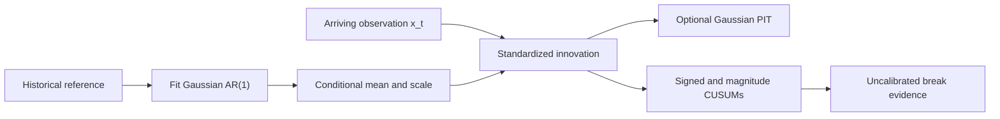

# BreakForge

**A Research Framework for Causal Structural Break Detection**

[](https://github.com/TranTrinhNhan1/BreakForge/actions/workflows/ci.yml)
[](LICENSE)

BreakForge is a research framework for causal, real-time structural-break detection in heterogeneous univariate time series. The ADIA Lab / CrunchDAO challenge motivated the problem; this project makes the streaming method, validation lessons, and research history reusable beyond the competition.

## Problem and causal contract

Given reference history and a stream `x_0, x_1, ...`, produce break evidence at each time `t`. A score may use the fitted reference and observations through `x_t`, never future values or final stream length. `fit(history)` freezes the reference, `update(x_t)` consumes one value, and `reset()` clears online state between independent series.

## Architecture



The public reference uses conditional Gaussian innovations and sequential CUSUM evidence. Its score is not a calibrated probability or alarm guarantee. PIT interpretation depends on the fitted conditional model being adequate.

## Quick start

The synthetic AR-break demo needs no competition data or credentials:

```bash
git clone https://github.com/TranTrinhNhan1/BreakForge.git
cd BreakForge
python -m venv .venv
# macOS / Linux
.venv/bin/python -m pip install -e .
.venv/bin/python examples/synthetic_break_demo.py
```

The demo simulates AR coefficient and noise-scale breaks. On Windows PowerShell, replace `.venv/bin/python` with `.venv\Scripts\python.exe`. Add `--plot` after installing `.[plot]` to save a figure.

## Streaming API

```python
from breakforge import StructuralBreakDetector

detector = StructuralBreakDetector(allowance=0.25).fit(history)
for x_t in stream:
    score = detector.update(x_t)
detector.reset()
```

Inputs must be finite real values; `fit` requires at least three history observations. `update` returns a non-decreasing, uncalibrated score. Reset the detector between independent series.

## Methods investigated

The catalog groups 139 method or variant records and six procedures or audits; repeated runs are not counted as new methods. It covers conditional PIT, sequential tests, kernels, density ratios, dynamics, spectral and path features, Bayesian and conformal methods, and learned models. See the [method catalog](docs/method_catalog.md), [failed experiments](docs/failed_experiments.md), [run crosswalk](reports/curated_results/run_variant_crosswalk.csv), and [additional report index](reports/additional_report_index.csv).

| Family | Examples | Role | Outcome in this project |
|---|---|---|---|
| Conditional normalization | AR residuals; PIT/Rosenblatt | Scale values using history. | AR(1) reference retained; PIT assumptions documented. |
| Statistical and sequential | Rolling moments; CUSUM; BOCPD | Detect changes and accumulate evidence. | CUSUM retained; score is uncalibrated. |
| Kernel and distributional | MMD/RFF; RuLSIF; Wasserstein | Compare recent and historical windows. | Matched-control findings are configuration-specific. |
| Dynamics and ordered structure | DMD/Koopman; spectra; signatures | Capture dependence and temporal geometry. | Selected gains often weakened against controls or diagnostics. |
| Learned representations and heads | TNC/contrastive; boosted trees; stacking | Learn or combine evidence channels. | Research results carry selection and nested-OOF caveats. |

## Results

### Public synthetic benchmark

In the fixed-seed synthetic benchmark, BreakForge AUC ranged from 0.4781 to 1.0000 across six generated breaks; the heavy-tail case was near chance. Its false-positive rate on unchanged streams was 0.025 under the stated calibration. These results are `SYNTHETIC_ONLY`, describe selected generators, and do not establish general performance. See [protocol and full metrics](docs/results.md#clean-reproducible-synthetic-benchmark).

### Official competition result

Competition scores, local CV, synthetic results, and invalidated historical values are not directly comparable. The strongest verified private result is TS-AUC **0.6213427008** (`CLOUD_PRIVATE; VERIFIED_OFFICIAL`), submission #21 / run 120227. Final rank and exact package identity are unverified; this was a different system, not a BreakForge benchmark. Historical CV results carry labels for future-length leakage, nested-OOF contamination, post-selection, or partial folds. See [results](docs/results.md) and the [validation guide](docs/validation.md).

## Validation lessons

- A real-time score cannot use `final_online_length` or other future-derived values.
- Every upstream fit in stacked evaluation must exclude the outer held-out group.
- Repeatedly selected folds do not provide an untouched estimate.

See the [validation guide](docs/validation.md) for exact-stream protocols, grouped folds, and causality tests.

## What did not work

Some high historical scores depended on future information or contaminated stacked features. Several selected methods lost their apparent advantage against matched controls or on reduced diagnostics. These findings apply to tested configurations, not whole method families.

## Competition origin and data

The Structural Break: Real-Time challenge motivated this work and its streaming constraints. Competition data, labels, predictions, and submission bundles are excluded. Users must supply data they are authorized to use; see [competition background](docs/competition.md).

## Repository structure

```text
src/breakforge/       causal detector, conditional PIT, validation utilities
examples/             synthetic streaming demonstrations
tests/                causality, reset, parity, determinism, fold isolation
configs/              reference configuration
scripts/              reproduction and user-data evaluation
reports/              synthetic results and curated research records
docs/                 methodology, validation, results, and research history
research_archive/     indexed conclusions from selected research
```

## Reproducibility and documentation

Install development tools, run tests, and regenerate the benchmark with:

```bash
.venv/bin/python -m pip install -e '.[dev]'
.venv/bin/python -m pytest -q
.venv/bin/python scripts/synthetic_benchmark.py
```

For methodology, validation, research history, and workflow, start at the [documentation index](docs/README.md).

## References

See the curated [references and further reading](docs/references.md).

## Citation

Use the project metadata in [CITATION.cff](CITATION.cff).

## License

BreakForge is distributed under the [MIT License](LICENSE).
