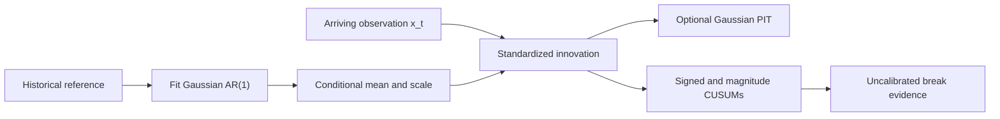

# BreakForge

**A Research Framework for Causal Structural Break Detection**

[](https://github.com/TranTrinhNhan1/BreakForge/actions/workflows/ci.yml)
[](LICENSE)

BreakForge is a research framework for causal, real-time break detection in heterogeneous univariate time series. The ADIA Lab / CrunchDAO Structural Break: Real-Time challenge motivated the work; the repository now presents the reusable methods, validation lessons, and research history independently of the competition.

## Why BreakForge?

Many break detectors are evaluated on complete sequences even when they are intended for online use. BreakForge makes the time-of-prediction constraint explicit and provides a compact, inspectable reference implementation alongside a curated account of methods that worked, failed, or remain uncertain.

## Problem definition

Given a reference history and a stream `x_0, x_1, ...`, produce a break-evidence score at each time `t`. A score may depend on the fitted reference and observations through `x_t`; it cannot use later observations or the eventual stream length.

## Causal contract and architecture



The public reference freezes its conditional model after `fit`. `update` consumes exactly one new value and advances sequential evidence. Its score is not a calibrated probability or an alarm guarantee. The PIT is available separately, and its interpretation depends on the conditional model being adequate.

## Quick start

```bash
python -m pip install -e .
python examples/synthetic_break_demo.py
```

The demo creates an AR process with a coefficient and noise-scale break; it needs no Crunch runtime or competition data. To save a figure, install `python -m pip install -e '.[plot]'` and run the demo with `--plot`.

## Streaming API

```python
from breakforge import StructuralBreakDetector

detector = StructuralBreakDetector(allowance=0.25)
detector.fit(history)  # estimate and freeze the reference

for x_t in stream:
    score = detector.update(x_t)  # consume one observation

detector.reset()  # clear online state; retain the fitted reference
```

Inputs are finite real values; `fit` requires at least three reference observations. `update` returns a non-decreasing, uncalibrated evidence score. Reset between series so state cannot carry across IDs. See [methodology](docs/methodology.md) for assumptions and [validation](docs/validation.md) for the streaming contract.

## Public benchmark

The fixed-seed synthetic benchmark covers six break mechanisms and a no-change control. The reference detector's AUC ranges from 0.4781 to 1.0000 across the six generated mechanisms; the heavy-tail case is near chance (0.4781 AUC, 0.075 detection rate). These are results for the stated synthetic generators, not general performance claims. Full settings, metrics, and limitations are in [results](docs/results.md).

## Official competition result

The highest verified provider result recorded here is TS-AUC **0.6213427008** for submission #21 / run 120227. The provider did not return an aggregate package digest, the final rank is unverified, and this submitted system differs from the public reference detector. It is private competition evidence, not a benchmark for BreakForge. See the [official result record](docs/results.md#official-competition-result).

## Validation lessons

- A real-time score cannot use `final_online_length` or any other future-derived quantity.
- Upstream stacked predictions can carry outer-fold information into nominal OOF features; nested evaluation must isolate every training stage.
- Historical CV numbers include invalid, selected, partial-fold, and contaminated results. They remain labeled and separate from reproducible synthetic evidence.

The [validation guide](docs/validation.md) explains the audits, controls, and causal tests.

## Methods investigated

The research covers conditional normalization and PITs, sequential tests, rolling and spectral statistics, kernels and density ratios, optimal transport, DMD/Koopman and Bayesian dynamics, signatures, conformal methods, learned representations, foundation models, and ensembles. These are investigated research families; only a small reference detector is in the public core. Browse the [method and variant catalog](docs/method_catalog.md) and [failed experiments](docs/failed_experiments.md) for configuration-level evidence and matched controls.

## Documentation

- [Methodology](docs/methodology.md) — conditional normalization and online scoring
- [Validation](docs/validation.md) — exact-stream evaluation, leakage, and fold isolation
- [Research journey](docs/research_journey.md) — how the investigation changed
- [Failed experiments](docs/failed_experiments.md) — negative and inconclusive results
- [Results](docs/results.md) — synthetic, official, and historical evidence, kept separate
- [References](docs/references.md) — papers and their role in the project
- [Research workflow](docs/research_workflow.md) — experiment and review practices

## Competition data and reproducibility

Competition data, labels, per-series predictions, and submission bundles are not included. Supply only data you are authorized to use for any competition-specific adapter. The public demo and tests work without them.

```bash
python -m pip install -e '.[dev]'
pytest -q
python examples/synthetic_break_demo.py
```

The core requires only Python at runtime; plotting is optional. See [CITATION.cff](CITATION.cff) for citation metadata. BreakForge is distributed under the [MIT License](LICENSE).
