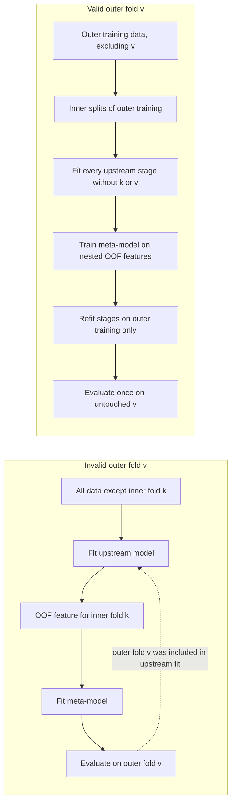

# Validation and causal integrity

Validation is part of the method. A detector can be prefix-causal at inference and still have an invalid score if model selection, feature generation, stacking, or threshold tuning used held-out information.

## Exact-stream evaluation

For an online observation sequence `x_0, ..., x_(T-1)`, the required information set at time `t` is the fitted reference and the observed prefix:

```text
score_t = f(reference, x_0, ..., x_t)
```

The score must not depend on `x_(t+1)...x_(T-1)`, the final sequence length `T`, or metadata that reveals the unobserved endpoint. Future-suffix invariance tests the practical implication: run the same prefix with two different suffixes and compare all scores on the shared prefix.

There is a useful distinction between knowing a container's length for output allocation and using that length to make a prediction. Preallocating an output array from the runtime-provided current input container need not change any score. Choosing a null distribution, calibration scale, threshold, model, or normalization based on the final length of the still-unseen stream changes the decision rule and is future-information leakage. A `length_hint` or similar protocol is safe only when its meaning is explicitly limited to the currently available prefix.

The historical audit found a more consequential case: a full online-segment length selected or parameterized null/calibration behavior in some experimental paths. Those scores are labeled `INVALID_FUTURE_LENGTH`. CrunchDAO staff later stated that pre-June 8 evaluations were invalidated and excluded after a data-access fix. The public detector does not inspect stream length and `update()` has no future-length argument.

One recorded P2 path chose a pseudo-online null segment length from `len(online)`. In real-time use that is the final, not-yet-observed horizon `T`; it changes the null evidence used for earlier observations. A later P11 configuration inherited a null-profile segment built with the same future-length rule. The historical CV-A values `0.6505362` (P2) and `0.6504968` (P11) are retained only with the `INVALID_FUTURE_LENGTH` label in [results](results.md).

```python
# Invalid: T is not available while an unsized stream is still arriving.
segment_length = min(max(final_online_length, 16), max_segment_length)

# Causal alternative: predeclare the null window from configuration/reference,
# or use a rule that depends only on the observed prefix through t.
segment_length = configured_null_length
```

## Grouped folds and out-of-fold predictions

When several rows or windows come from one time series, folds must be assigned by series ID, not by row. All rows from a held-out series belong to the same fold. The public `split_ids_by_fold` helper makes the train/held-out partition explicit; it does not train a model or prove that every surrounding pipeline component respects the split.

Out-of-fold (OOF) features for a training series must come from a model that did not train on that series. This requirement applies to every upstream transformation whose fitted state can affect the feature: normalization, feature selection, representation models, calibration, and any stacked predictor.

## Nested stacking and indirect contamination

An outer held-out fold `v` must remain absent from every fit used to produce predictions for `v`, including the inner OOF features used to train a meta-model. A common failure is to generate inner-fold predictions from an upstream model trained on all data except inner fold `k`. If that fit includes the outer fold `v`, then the upstream representation has already seen the nominal outer validation data. The meta-model's input for `k` carries information from `v`, even if the meta-model itself is evaluated only on `v`.



Correct nested procedure for each outer fold:

1. Set aside the outer validation IDs and do not use them for fitting, feature learning, threshold choice, or model selection.
2. Within the remaining outer-training IDs, create inner grouped folds.
3. For each inner fold, fit every upstream stage on the other inner-training IDs, then create that inner fold's OOF features.
4. Fit the meta-model using only those nested OOF features and labels from outer-training IDs.
5. Refit each upstream stage on all outer-training IDs, generate outer-validation features, and evaluate the meta-model once on the untouched outer fold.

Saved single-layer OOF predictions do not by themselves prove that an upstream stacked stage was nested correctly. If an artifact lacks fit IDs, fold assignments, configuration, seed, and code version, its independence cannot be inferred from its filename.

## Selection bias and sealed holdouts

Repeatedly comparing features, model families, hyperparameters, thresholds, or score transformations on the same CV results adapts the research process to those folds. The best observed CV score is then a post-selection estimate and is usually optimistic. Keeping the data split fixed does not undo this effect.

Use development folds to form hypotheses, nested folds for model selection when feasible, and a sealed holdout once for a final estimate. A sealed holdout must remain inaccessible to feature design and threshold tuning. Record every reported result with its dataset provenance, IDs/folds, metric definition, seed, configuration, code revision, and selection history.

The historical project had a one-time grouped-ID CV-B score audit. The access log says candidate selection did not continue after that score read, but later metadata-only access exposed holdout manifest information and artifact paths. The split therefore cannot be described as an untouched, sealed final holdout in this release. Do not reuse it for tuning or report its diagnostic values as a clean sealed-holdout estimate. This is distinct from exposing labels or prediction contents, which the access log does not record.

## Historical validity labels

These labels describe evidence status, not method quality. `SYNTHETIC_ONLY` and `CLOUD_PRIVATE` describe data provenance; they do not establish validity on their own. Result ledgers may also carry scope, reproducibility, or run-outcome tags. Those tags are defined below and should not be read as extra evidence of model quality.

| Label | Meaning | Public interpretation |
|---|---|---|
| `INVALID_FUTURE_LENGTH` | The prediction or calibration path depended on the final unseen online length. | Not a valid real-time result; never use as a benchmark. |
| `NON_NESTED_META_CV` | Outer-fold information could reach a meta-training representation through an upstream fitted stage. | Not an independent outer-fold estimate. |
| `POST_SELECTION_CV` | The reported result was selected after repeated comparison on the same CV evidence. | Exploratory estimate, not an unbiased final benchmark. |
| `PARTIAL_FOLD` | Evaluation covered only part of the intended IDs/folds. | Incomplete; do not compare as full-protocol evidence. |
| `VALID_EXACT_STREAM` | The recorded inference path used only the reference and exact observed prefix. | Describes inference causality only; says nothing by itself about fold independence or generalization. |
| `REDUCED_ONLY` | Evaluation used a reduced diagnostic sample rather than the intended full evaluation set. | A limited diagnostic; do not substitute for a full benchmark. |
| `UNKNOWN_PROVENANCE` | Available records do not establish the data, split, code, or evaluation path. | Withhold from benchmark comparisons or label the uncertainty explicitly. |
| `SYNTHETIC_ONLY` | The result comes from generated data included in the public reproduction path. | Reproducible for the stated generator and configuration; it does not establish competition transfer. |
| `CLOUD_PRIVATE` | The aggregate comes from private competition or provider-evaluation data. | The underlying data are not redistributed and the result cannot be replayed from this repository. |
| `VERIFIED_OFFICIAL_RUN` | A provider record supports the reported run outcome and score. | Does not independently verify final rank or exact serialized-package identity. |
| `ONE_TIME_EXPOSED_DIAGNOSTIC` | A grouped diagnostic was viewed once, but later metadata exposure prevents treating it as a sealed holdout. | Do not tune on it or describe it as a clean final test. |
| `FEATURE_COMPONENT_PARITY_ONLY` | Individual feature builders passed prefix-level parity checks. | Does not establish parity of the integrated detector or submission package. |
| `PACKAGE_PARITY_UNKNOWN` | The integrated inference package lacks a complete parity receipt. | Do not treat feature-level checks or OOF scores as deployable-package evidence. |
| `SYNTHETIC_STAGE0_HELD_SEED` | A fixed exploratory method screen held out generated seeds. | Keep outside the public benchmark unless its code, protocol, and result are independently reproducible. |
| `UNKNOWN_FROM_PUBLIC_INDEX` | Public source records do not establish the method detail, data, split, or inference path. | Keep the uncertainty explicit; do not infer that unrecorded checks passed. |
| `UNKNOWN_PROTOCOL` | An archived result lacks enough protocol detail for the exact-stream standard. | Do not compare it with verified exact-stream evidence. |
| `CAUSALITY_AUDIT_UNKNOWN` | Available evidence does not resolve whether the inference path was prefix-causal. | Do not call it a validated streaming result. |
| `PACKAGE_PARITY_UNVERIFIED` | The integrated package lacks a complete parity record. | Treat package-level deployment behavior as unverified. |
| `PACKAGE_REPLAY_PENDING` | The integrated package replay has not been completed. | Do not claim deployment-level reproduction. |
| `PRIVATE_DATA_NOT_REPRODUCIBLE_HERE` | The result depends on private inputs absent from this repository. | The code and data needed for an independent replay are not available here. |
| `PRIVATE_DATA_UNAVAILABLE` | The required private data cannot be accessed from this repository. | The result cannot be replayed here. |
| `RETROSPECTIVE_NOT_ONLINE` | A diagnostic was calculated after the stream rather than emitted online at each prefix. | It cannot demonstrate online inference behavior. |
| `PARTIAL_FOLD_WHERE_APPLICABLE` | Some entries in a grouped catalog record used an incomplete fold screen. | Check the record-level scope before making a full-fold comparison. |

### Provenance, scope, and run-outcome tags

These tags can appear alongside validity labels in the catalog and result CSVs:

| Tag | Meaning |
|---|---|
| `GROUPED_CV_A` | The result used grouped CV-A folds; this does not establish nesting or selection validity. |
| `FULL_GROUPED_CV_A` | The result covered the complete grouped CV-A fold set; this does not establish nesting or selection validity. |
| `FULL_FOLD_CONFIRMATION_AFTER_F0_F4_SEARCH` | A fixed candidate was evaluated on all folds after folds F0/F4 had already informed the search. |
| `SYNTHETIC_OR_STAGE0_ONLY` | Exploratory or synthetic screening evidence, separate from the checked-in reproducible benchmark. |
| `SYNTHETIC_STAGE0` | An exploratory synthetic screen, separate from the checked-in reproducible benchmark. |
| `PRIVATE_BREAK_MAGNITUDE_DIAGNOSTIC` | A private-data diagnostic about break magnitude; the tag does not imply public reproducibility. |
| `OFFICIAL_RUN` | A provider-linked submission or run record; it can describe a failed attempt with no score. |
| `NO_SCORE` | No metric was returned for that run. |
| `PACKAGE_ASSEMBLY_FAILURE` | The submission failed during package import or assembly before inference. |

Historical stacked CV work was found to include `NON_NESTED_META_CV` and `POST_SELECTION_CV` cases; earlier length-dependent work was `INVALID_FUTURE_LENGTH`. Some later paths satisfied exact-prefix checks, but incomplete manifests prevent a complete nested replay. These results are therefore not combined into a clean benchmark table. No substitute score is inferred. Selected aggregates and their individual labels are in [results.md](results.md); the official private score is kept separate from local CV estimates.

The local nested-OOF audit specifically qualified the Trial 11 CV-A mean `0.6344382`, Trial 52 `0.6340387`, the D3+D2 replay `0.6345702`, and the DMD/Koopman blend `0.6356422` as `NON_NESTED_META_CV`. Later post-hoc blends at `0.6361802` and `0.6363125` inherit the same contamination and also carry `POST_SELECTION_CV`. Their inference paths could be causal while their fold estimates were dependent on held-out labels through upstream fits. The separately reported private run is not invalidated by this local CV lineage finding.

## Tests in this repository

The fast public suite checks future-suffix invariance, deterministic replay, reset isolation, equivalence of the streaming wrapper to direct updates, and ID-level fold exclusion. These tests are regression checks for the current public baseline. They do not certify historical experiments, prove a parametric model correct, or replace dataset-level nested validation.

Run them with:

```bash
pytest -q
```

See [research journey](research_journey.md) and the [archive index](../research_archive/README.md) for the source audits behind these lessons.
