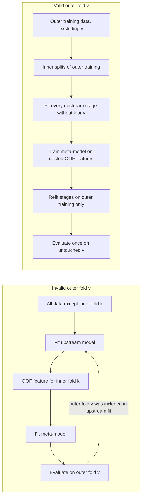

# Validation and causal integrity

Validation is part of the method. A detector can be prefix-causal at inference and still have an invalid score if model selection, feature generation, stacking, or threshold tuning used held-out information.

## Exact-stream evaluation

For an online observation sequence `x_0, ..., x_(T-1)`, the required information set at time `t` is the fitted reference and the observed prefix:

```text
score_t = f(reference, x_0, ..., x_t)
```

The score must not depend on `x_(t+1)...x_(T-1)`, the final sequence length `T`, or metadata that reveals the unobserved endpoint. Future-suffix invariance tests the practical implication: run the same prefix with two different suffixes and compare all scores on the shared prefix.

There is a useful distinction between knowing a container's length for output allocation and using that length to make a prediction. Preallocating an output array from the runtime-provided current input container need not change any score. Choosing a null distribution, calibration scale, threshold, model, or normalization based on the final length of the still-unseen stream changes the decision rule and is future-information leakage. A `length_hint` or similar protocol is safe only when its meaning is explicitly limited to the currently available prefix.

The historical audit found a more consequential case: a full online-segment length selected or parameterized null/calibration behavior in some experimental paths. Those scores are labeled `INVALID_FUTURE_LENGTH`. CrunchDAO staff later stated that pre-June 8 evaluations were invalidated and excluded after a data-access fix. The public detector does not inspect stream length and `update()` has no future-length argument.

## Grouped folds and out-of-fold predictions

When several rows or windows come from one time series, folds must be assigned by series ID, not by row. All rows from a held-out series belong to the same fold. The public `split_ids_by_fold` helper makes the train/held-out partition explicit; it does not train a model or prove that every surrounding pipeline component respects the split.

Out-of-fold (OOF) features for a training series must come from a model that did not train on that series. This requirement applies to every upstream transformation whose fitted state can affect the feature: normalization, feature selection, representation models, calibration, and any stacked predictor.

## Nested stacking and indirect contamination

An outer held-out fold `v` must remain absent from every fit used to produce predictions for `v`, including the inner OOF features used to train a meta-model. A common failure is to generate inner-fold predictions from an upstream model trained on all data except inner fold `k`. If that fit includes the outer fold `v`, then the upstream representation has already seen the nominal outer validation data. The meta-model's input for `k` carries information from `v`, even if the meta-model itself is evaluated only on `v`.



Correct nested procedure for each outer fold:

1. Set aside the outer validation IDs and do not use them for fitting, feature learning, threshold choice, or model selection.
2. Within the remaining outer-training IDs, create inner grouped folds.
3. For each inner fold, fit every upstream stage on the other inner-training IDs, then create that inner fold's OOF features.
4. Fit the meta-model using only those nested OOF features and labels from outer-training IDs.
5. Refit each upstream stage on all outer-training IDs, generate outer-validation features, and evaluate the meta-model once on the untouched outer fold.

Saved single-layer OOF predictions do not by themselves prove that an upstream stacked stage was nested correctly. If an artifact lacks fit IDs, fold assignments, configuration, seed, and code version, its independence cannot be inferred from its filename.

## Selection bias and sealed holdouts

Repeatedly comparing features, model families, hyperparameters, thresholds, or score transformations on the same CV results adapts the research process to those folds. The best observed CV score is then a post-selection estimate and is usually optimistic. Keeping the data split fixed does not undo this effect.

Use development folds to form hypotheses, nested folds for model selection when feasible, and a sealed holdout once for a final estimate. A sealed holdout must remain inaccessible to feature design and threshold tuning. Record every reported result with its dataset provenance, IDs/folds, metric definition, seed, configuration, code revision, and selection history.

The historical project had a one-time grouped-ID CV-B score audit. The access log says candidate selection did not continue after that score read, but later metadata-only access exposed holdout manifest information and artifact paths. The split therefore cannot be described as an untouched, sealed final holdout in this release. Do not reuse it for tuning or report its diagnostic values as a clean sealed-holdout estimate. This is distinct from exposing labels or prediction contents, which the access log does not record.

## Historical validity labels

These labels describe evidence status, not method quality:

| Label | Meaning | Public interpretation |
|---|---|---|
| `INVALID_FUTURE_LENGTH` | The prediction or calibration path depended on the final unseen online length. | Not a valid real-time result; never use as a benchmark. |
| `NON_NESTED_META_CV` | Outer-fold information could reach a meta-training representation through an upstream fitted stage. | Not an independent outer-fold estimate. |
| `POST_SELECTION_CV` | The reported result was selected after repeated comparison on the same CV evidence. | Exploratory estimate, not an unbiased final benchmark. |
| `PARTIAL_FOLD` | Evaluation covered only part of the intended IDs/folds. | Incomplete; do not compare as full-protocol evidence. |
| `VALID_EXACT_STREAM` | The recorded inference path used only the reference and exact observed prefix. | Describes inference causality only; says nothing by itself about fold independence or generalization. |
| `REDUCED_ONLY` | Evaluation used a reduced diagnostic sample rather than the intended full evaluation set. | A limited diagnostic; do not substitute for a full benchmark. |
| `UNKNOWN_PROVENANCE` | Available records do not establish the data, split, code, or evaluation path. | Withhold from benchmark comparisons or label the uncertainty explicitly. |

Historical stacked CV work was found to include `NON_NESTED_META_CV` and `POST_SELECTION_CV` cases; earlier length-dependent work was `INVALID_FUTURE_LENGTH`. Some later paths satisfied exact-prefix checks, but incomplete manifests prevent a complete nested replay. These results are therefore not combined into a clean benchmark table. No substitute score is inferred. Selected aggregates and their individual labels are in [results.md](results.md); the official private score is kept separate from local CV estimates.

## Tests in this repository

The fast public suite checks future-suffix invariance, deterministic replay, reset isolation, equivalence of the streaming wrapper to direct updates, and ID-level fold exclusion. These tests are regression checks for the current public baseline. They do not certify historical experiments, prove a parametric model correct, or replace dataset-level nested validation.

Run them with:

```bash
pytest -q
```

See [research journey](research_journey.md) and the [archive index](../research_archive/README.md) for the source audits behind these lessons.
